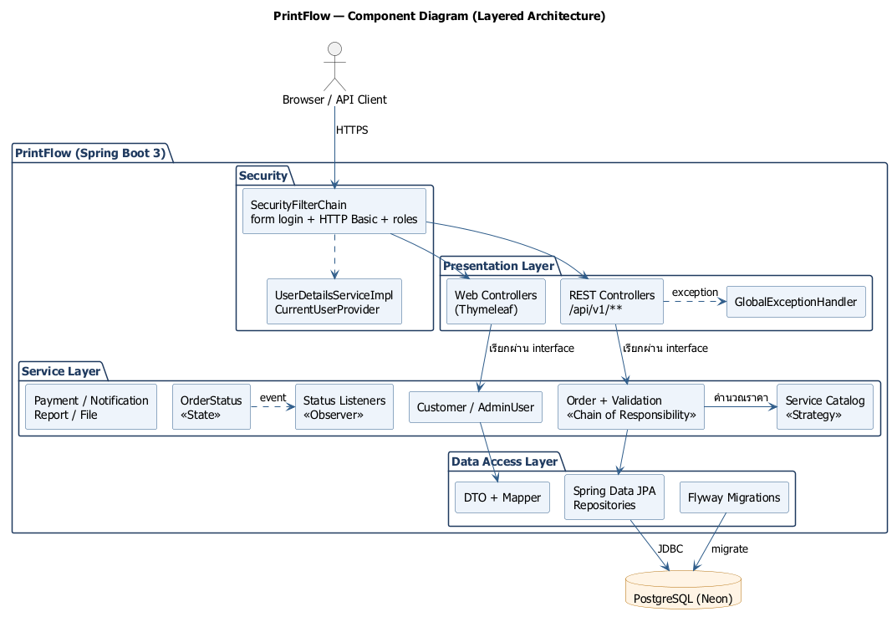
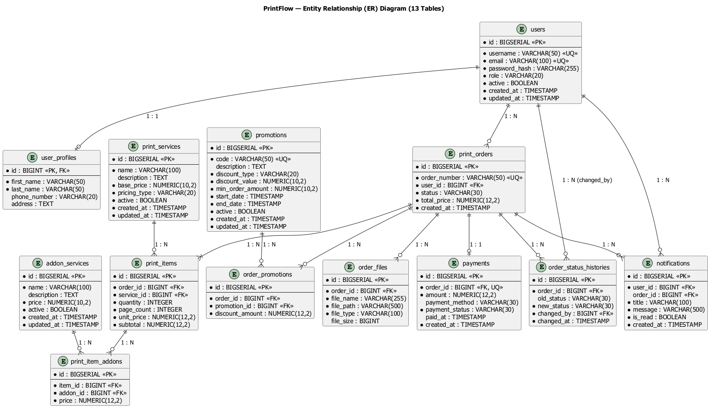
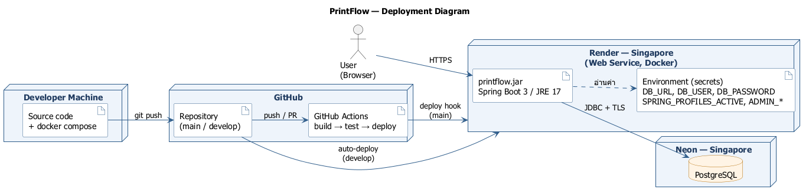

# PrintFlow — ระบบจัดการร้านรับพิมพ์เอกสารและบริการงานพิมพ์

PrintFlow เป็นเว็บแอปสำหรับร้านรับพิมพ์เอกสาร ลูกค้าสมัครสมาชิก เลือกบริการพิมพ์ (ขาวดำ / สี / รูปภาพ) พร้อมบริการเสริม
อัปโหลดไฟล์ ใช้โค้ดโปรโมชั่น และติดตามสถานะคำสั่งพิมพ์ได้แบบเรียลไทม์
พนักงานรับงาน เปลี่ยนสถานะ (PENDING → CONFIRMED → PROCESSING → READY → COMPLETED หรือ CANCELLED) และบันทึกการชำระเงิน
ผู้ดูแลระบบจัดการบริการ โปรโมชั่น บัญชีผู้ใช้ และดูรายงานสรุป
พัฒนาด้วย Spring Boot แบบ Layered Architecture พร้อม REST API (Swagger) และหน้าเว็บ Thymeleaf

รายวิชา CP353002 Principles of Software Design and Development

**Deployment URL:** https://printflow-ogm4.onrender.com · Swagger UI: https://printflow-ogm4.onrender.com/swagger-ui.html
(Render free plan — เปิดครั้งแรกอาจรอ 30–60 วินาที ดูรายละเอียดที่ [Deployment URL](#deployment-url))

## สมาชิกกลุ่ม

| ลำดับ | ชื่อ-นามสกุล | รหัสนักศึกษา | Section | Branch | หน้าที่รับผิดชอบ |
|---|---|---|---|---|---|
| 1 | นายณัฐชา อรรคฮาต | 673380582-6 | 04 | `Nattacha_673380582-6_04` | **P1** — Auth, User, Admin, Report, Security, Exception Handling, DevOps (Docker, CI/CD, Deploy), README |
| 2 | นายปฏิภาณ ปานทะเล | 673380411-3 | 04 | `Patipan_673380411-3_04` | **P2** — Service, Addon, Promotion, Strategy Pattern (Pricing / Discount), ER Diagram, Data Dictionary |
| 3 | นายรัชชานนท์ ประดับแก้ว | 673380599-9 | 04 | `Ratchanon_673380599-9_04` | **P3** — Order, Item, File, Chain of Responsibility (Validation), Class / Activity Diagram |
| 4 | นายอาณัฐ อารีย์ | 673380432-5 | 04 | `arnat_6733804325_04` | **P4** — Order Status (State Pattern), Observer, Notification, Payment, State Diagram, Slide |

## Tech Stack

| ส่วน | เทคโนโลยี |
|---|---|
| Language | Java 17 |
| Framework | Spring Boot 3.1.5 (Web, Data JPA, Validation, Security, Thymeleaf) |
| Build Tool | Maven |
| Database | PostgreSQL 15 (local: Docker / production: Neon) |
| Migration | Flyway |
| ORM | Spring Data JPA (Hibernate) |
| Frontend | Thymeleaf + Thymeleaf Extras Spring Security 6 |
| API Docs | springdoc-openapi 2.2.0 (Swagger UI) |
| Security | Spring Security (Form Login + HTTP Basic, BCrypt, Role-based) |
| Testing | JUnit 5, Mockito, Spring Boot Test (`@WebMvcTest`, `@DataJpaTest`, `@SpringBootTest` + H2) |
| Container | Docker (multi-stage build), Docker Compose |
| CI/CD | GitHub Actions (Build → Test → Deploy) |
| Hosting | Render (Web Service, Docker) |

## System Architecture

ระบบแยกเป็น Layer ชัดเจน และ **Controller เรียกได้เฉพาะ Service** (ไม่เรียก Repository ตรง)

```
Presentation   controller/api (REST, JSON)  ·  controller/web (Thymeleaf)
      ↓
Service        service/ (interface)  ·  service/impl  ·  service/strategy  ·  service/state
               service/event + service/listener (Observer)  ·  validation/ (Chain of Responsibility)
      ↓
Repository     repository/ (Spring Data JPA)
      ↓
Domain         domain/entity  ·  domain/enums

+ dto/ (request, response, form) + mapper/   แยก Entity ออกจาก API
+ config/ · security/ · exception/
```



**เอกสารประกอบ**

| เอกสาร | ไฟล์ |
|---|---|
| SOLID Principles (ไฟล์ + บรรทัด + เหตุผล) | [`doc/solid-analysis.md`](doc/solid-analysis.md) |
| Design Patterns (ปัญหาที่แก้ + คลาสที่ใช้ + Class Diagram) | [`doc/design-patterns.md`](doc/design-patterns.md) |
| Use Case Description (14 use case) | [`doc/use-case-description.md`](doc/use-case-description.md) |
| Data Dictionary (13 ตาราง) | [`doc/data-dictionary.md`](doc/data-dictionary.md) |
| Diagram ทั้งหมด (Use Case, Domain Model, Class, Sequence ×3, Activity, ER, Component, Deployment, State) | [`doc/diagrams/`](doc/diagrams/) |
| สไลด์นำเสนอ | [`doc/slide/PrintFlow-presentation.pdf`](doc/slide/PrintFlow-presentation.pdf) |

**Design Patterns ที่ใช้ (GoF Behavioral)**

| Pattern | ใช้ทำอะไร | ผู้รับผิดชอบ |
|---|---|---|
| Strategy | สูตรราคา 3 แบบ (ขาวดำ / สี / รูปภาพ) และส่วนลด 2 แบบ (เปอร์เซ็นต์ / บาท) | P2 |
| Chain of Responsibility | ตรวจคำสั่งพิมพ์ 5 ขั้นก่อนบันทึก | P3 |
| State | กฎการเปลี่ยนสถานะของคำสั่งพิมพ์ 6 สถานะ | P4 |
| Observer | Spring Event 2 ตัว → listener 5 ตัว (สร้าง payment, แจ้งเตือน, บันทึกประวัติ, คืนเงิน) | P4 |

## Database Design (ER Diagram)



> ER Diagram และ Data Dictionary ฉบับเต็ม (13 ตาราง) — จัดทำโดย P2: [`doc/diagrams/er-diagram.md`](doc/diagrams/er-diagram.md) และ [`doc/data-dictionary.md`](doc/data-dictionary.md)

| ตาราง | เจ้าของ | ความสัมพันธ์หลัก |
|---|---|---|
| `users`, `user_profiles` | P1 | User 1:1 UserProfile |
| `print_services`, `addon_services`, `promotions` | P2 | ข้อมูลหลักของบริการและโปรโมชั่น |
| `print_orders`, `print_items`, `print_item_addons`, `order_promotions`, `order_files` | P3 | User 1:N Order, Order 1:N Item, Item M:N Addon, Order M:N Promotion, Order 1:N File |
| `payments`, `order_status_histories`, `notifications` | P4 | Order 1:1 Payment, Order 1:N History |

Schema ถูกสร้างด้วย Flyway จาก `code/src/main/resources/db/migration/` (V1–V9)

| Migration | เนื้อหา |
|---|---|
| V1 | users, user_profiles |
| V2 | print_services, addon_services, promotions |
| V3 | print_orders, print_items, print_item_addons, order_promotions, order_files |
| V4 | payments, order_status_histories, notifications |
| V5 | ข้อมูลตั้งต้น (บริการ บริการเสริม โปรโมชัน) |
| V6 | `print_items.page_count` (จำนวนหน้าต่อชุด) |
| V7 | เติม payment ให้ order เก่าที่ยังไม่มี |
| V8 | แก้คำอธิบาย Lamination เป็นคิดต่อชุด |
| V9 | เพิ่ม FK จาก print_items, print_item_addons, order_promotions ไปยังบริการและโปรโมชัน |

## Installation & Setup

**สิ่งที่ต้องมี**
- JDK 17 ขึ้นไป
- Maven 3.9+
- Docker Desktop (ถ้าจะรัน PostgreSQL ด้วย Docker)

**ขั้นตอน**
```bash
git clone https://github.com/bbthecat/Print_shop_final.git
cd Print_shop_final
```
`main` คือเวอร์ชันที่ส่งมอบ (release v1.0) ส่วน `develop` คือ branch ที่รวมงานระหว่างพัฒนา

**Environment Variables** (มีค่า default สำหรับรันในเครื่องอยู่แล้ว)

| ตัวแปร | ความหมาย | ค่า default |
|---|---|---|
| `DB_URL` | JDBC URL ของ PostgreSQL | `jdbc:postgresql://localhost:5432/printflow` |
| `DB_USER` / `DB_PASSWORD` | ผู้ใช้และรหัสผ่านฐานข้อมูล | `postgres` / `postgres` |
| `PORT` | พอร์ตของแอป | `8080` |
| `SPRING_PROFILES_ACTIVE` | ตั้งเป็น `prod` บน production | — |
| `ADMIN_USERNAME` / `ADMIN_EMAIL` / `ADMIN_PASSWORD` | ถ้าตั้งไว้ ระบบจะสร้างบัญชี ADMIN ให้ตอนเริ่มแอป (ครั้งเดียว) | — |

## How to Run

**วิธีที่ 1: Docker Compose (แอป + ฐานข้อมูล)**
```bash
cd code
docker compose up --build
```

**วิธีที่ 2: รันแอปด้วย Maven (ใช้ PostgreSQL จาก Docker)**
```bash
cd code
docker compose up -d postgres
mvn spring-boot:run
```

จากนั้นเปิด
- หน้าเว็บ: http://localhost:8080
- Swagger UI: http://localhost:8080/swagger-ui.html

ถ้าต้องการบัญชี ADMIN ในเครื่อง ให้ตั้ง `ADMIN_USERNAME`, `ADMIN_EMAIL`, `ADMIN_PASSWORD` ก่อนรัน

## API Documentation

เอกสาร API แบบโต้ตอบได้: **Swagger UI** ที่ `/swagger-ui.html` (กดปุ่ม **Authorize** แล้วใส่ username / password เพื่อเรียก API ที่ต้อง login)

| Resource | Endpoint | สิทธิ์ |
|---|---|---|
| Customers | `POST /api/v1/customers` (สมัครสมาชิก) | ทุกคน |
| | `GET`, `PUT /api/v1/customers/me` | ผู้ที่ login |
| | `GET /api/v1/customers?page=0&size=10&sort=username,desc` | STAFF, ADMIN |
| | `GET`, `PUT /api/v1/customers/{id}` | STAFF, ADMIN |
| | `DELETE /api/v1/customers/{id}` (soft delete) | ADMIN |
| Admin Users | `GET`, `POST /api/v1/admin/users` · `GET /api/v1/admin/users/{id}` · `PATCH /{id}/role` · `PATCH /{id}/status` | ADMIN |
| Print Services | `GET /api/v1/services?page=0&size=10&sort=id` · `GET /api/v1/services/{id}` | ทุกคน |
| | `POST /api/v1/services` · `PUT`, `DELETE /api/v1/services/{id}` | ADMIN |
| Addon Services | `GET /api/v1/addon-services` · `GET /api/v1/addon-services/{id}` | ทุกคน |
| | `POST /api/v1/addon-services` · `PUT`, `DELETE /api/v1/addon-services/{id}` | ADMIN |
| Promotions | `GET /api/v1/promotions` · `GET /api/v1/promotions/{id}` · `GET /api/v1/promotions/validate/{code}` | ผู้ที่ login |
| | `POST /api/v1/promotions` · `DELETE /api/v1/promotions/{id}` | ADMIN |
| Orders | `POST /api/v1/orders` (สร้างในชื่อคนที่ login) | ผู้ที่ login |
| | `GET /api/v1/orders/{id}` · `GET /{id}/items` · `GET /{id}/files` | เจ้าของ order, STAFF, ADMIN |
| | `GET /api/v1/orders?status=PENDING&page=0&size=10` | STAFF, ADMIN |
| | `DELETE /api/v1/orders/{id}` (เฉพาะ PENDING) | ADMIN |
| Order Status | `POST /api/v1/orders/{id}/cancel` (ลูกค้ายกเลิกเองตอน PENDING) | เจ้าของ order |
| | `GET /api/v1/orders/{id}/status-histories` | เจ้าของ order, STAFF, ADMIN |
| | `PATCH /api/v1/orders/{id}/status` | STAFF, ADMIN |
| Payment | `GET /api/v1/orders/{id}/payment` | เจ้าของ order, STAFF, ADMIN |
| | `POST`, `PATCH /api/v1/orders/{id}/payment` (สร้าง / บันทึกว่าชำระแล้ว) | STAFF, ADMIN |
| Notifications | `GET /api/v1/notifications` · `GET /unread-count` · `PATCH /{id}/read` | ผู้ที่ login (เห็นเฉพาะของตัวเอง) |
| Reports | `GET /api/v1/reports/summary?from=2026-10-01&to=2026-10-31` | ADMIN |

**หน้าเว็บหลัก (Thymeleaf)**

| บทบาท | หน้า |
|---|---|
| ทุกคน | `/` หน้าแรก · `/services` บริการ · `/login` · `/register` |
| ลูกค้า | `/orders/create` สั่งพิมพ์ · `/orders` ประวัติ · `/orders/{id}` รายละเอียด/ยกเลิก · `/orders/{id}/tracking` · `/notifications` · `/profile` |
| พนักงาน | `/staff/dashboard` · `/staff/orders` · `/staff/orders/{id}` เปลี่ยนสถานะ · `/staff/payments` |
| ผู้ดูแลระบบ | `/admin/services` · `/admin/promotions` · `/admin/users` · `/admin/reports` (+ ทุกหน้าของพนักงาน) |

**รูปแบบ Error มาตรฐาน** (จาก `GlobalExceptionHandler`)
```json
{
  "timestamp": "2026-10-09T10:00:00",
  "status": 409,
  "error": "Conflict",
  "message": "Username already exists: somchai",
  "path": "/api/v1/customers",
  "validationErrors": null
}
```

| Status | เมื่อไหร่ |
|---|---|
| 200 / 201 / 204 | สำเร็จ / สร้างสำเร็จ (มี `Location` header) / ลบสำเร็จ |
| 400 | ข้อมูลไม่ผ่าน `@Valid` (มี `validationErrors` รายช่อง) หรือผิดกฎธุรกิจ |
| 401 / 403 | ยังไม่ login / สิทธิ์ไม่พอ |
| 404 | ไม่พบข้อมูล |
| 409 | ข้อมูลซ้ำ หรือเปลี่ยนสถานะคำสั่งพิมพ์ผิดลำดับ |
| 500 | ข้อผิดพลาดที่ไม่คาดคิด (ไม่เปิดเผยรายละเอียดภายใน) |

## How to Run Tests

```bash
cd code
mvn clean verify                       # build + รัน test ทั้งหมด
mvn surefire-report:report-only        # สร้างรายงาน HTML ที่ target/reports/surefire.html
```

- **257 test ผ่านทั้งหมด** (30+ คลาส) — สรุปผลอยู่ที่ [`test/test-report/`](test/test-report/)
- Unit test ของ Service ใช้ JUnit 5 + Mockito (สูตรราคา/ส่วนลดใช้ Strategy ตัวจริง)
- Test ของ Controller ใช้ `@WebMvcTest` (รวมการทดสอบสิทธิ์ตาม role, ห้ามดูข้อมูลของคนอื่น และ CSRF)
- Test ของ Repository ใช้ `@DataJpaTest` + H2 (`OrderRepositoryTest`, `ReportRepositoryTest`)
- Integration test `ObserverIntegrationTest` (`@SpringBootTest` + H2) ทดสอบ flow จริง: สร้าง order → ยืนยัน → ชำระเงิน → ยกเลิก
- GitHub Actions รัน test ทุกครั้งที่ push / เปิด PR เข้า `develop` และ `main` และเก็บ test report เป็น artifact

## Deployment URL

- **App:** https://printflow-ogm4.onrender.com
- **Swagger UI:** https://printflow-ogm4.onrender.com/swagger-ui.html
- **Hosting:** Render (Docker, Singapore) + Neon PostgreSQL (Singapore)
- **CI/CD:** GitHub Actions รัน `mvn clean verify` ทุก push / PR เข้า `develop` และ `main`
- **Production deploy จาก `main` เท่านั้น** (`render.yaml`: `branch: main`, `autoDeploy: false`) — เมื่อ push เข้า `main` และ test ผ่าน job `deploy` จะเรียก Render Deploy Hook (URL เก็บใน GitHub Secret `RENDER_DEPLOY_HOOK_URL`)
- ค่าลับของ production (`DB_URL`, `DB_USER`, `DB_PASSWORD`, `ADMIN_*`) ตั้งไว้ใน Environment ของ Render ไม่อยู่ใน git
- หมายเหตุ: Render free plan จะหลับเมื่อไม่มีการใช้งาน ~15 นาที การเปิดครั้งแรกอาจใช้เวลา 30–60 วินาที



## Project Structure

```
Print_shop_final/
├── .github/
│   ├── workflows/ci.yml            # CI/CD: build → test → deploy
│   └── pull_request_template.md
├── code/                           # Source code + Configuration
│   ├── Dockerfile                  # multi-stage: Maven build → JRE 17
│   ├── docker-compose.yml          # app + postgres
│   ├── pom.xml
│   └── src/
│       ├── main/java/com/printflow/
│       │   ├── config/             # Security, OpenAPI, PasswordEncoder, Admin bootstrap
│       │   ├── controller/
│       │   │   ├── api/            # REST Controllers (/api/v1/**)
│       │   │   └── web/            # Thymeleaf Controllers
│       │   ├── domain/
│       │   │   ├── entity/
│       │   │   └── enums/
│       │   ├── dto/                # request / response / form
│       │   ├── exception/          # custom exceptions + GlobalExceptionHandler
│       │   ├── mapper/             # Entity ↔ DTO
│       │   ├── repository/         # Spring Data JPA
│       │   ├── security/           # UserDetails, CurrentUserProvider
│       │   ├── service/            # interface + impl, strategy/, state/, event/, listener/
│       │   └── validation/         # Chain of Responsibility (ตรวจคำสั่งพิมพ์)
│       ├── main/resources/
│       │   ├── application.yml, application-prod.yml
│       │   ├── db/migration/       # Flyway V1–V9
│       │   ├── templates/          # Thymeleaf
│       │   └── static/css/
│       └── test/java/              # JUnit 5 + Mockito + WebMvcTest + DataJpaTest
├── test/test-report/               # สรุปผลการทดสอบ + surefire report
├── doc/                            # solid-analysis, design-patterns, use-case, data-dictionary
│   ├── diagrams/                   # .puml / .png ของทุก diagram
│   └── slide/                      # สไลด์นำเสนอ (PDF)
├── img/                            # ไฟล์มัลติมีเดีย
├── render.yaml                     # Render Blueprint
└── README.md
```
