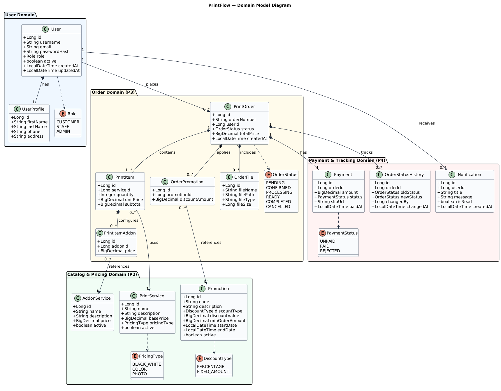

# Domain Model Diagram — PrintFlow

ต้นฉบับ PlantUML: [`domain-model.puml`](domain-model.puml)

## สรุปโมเดลโดเมนตามส่วนงาน
1. **User Domain (P1)**: จัดการบัญชีผู้ใช้ ข้อมูลโปรไฟล์ส่วนตัว และบทบาท (Customer, Staff, Admin)
2. **Catalog & Pricing Domain (P2)**: จัดการบริการงานพิมพ์หลัก (`PrintService`), บริการเสริม (`AddonService`), และโปรโมชัน (`Promotion`)
3. **Order Domain (P3)**: จัดการคำสั่งพิมพ์ (`PrintOrder`), รายการสั่งพิมพ์ (`PrintItem`), บริการเสริมของรายการ (`PrintItemAddon`), ไฟล์แนบ (`OrderFile`), และโปรโมชันที่ใช้ (`OrderPromotion`)
4. **Payment & Tracking Domain (P4)**: จัดการการชำระเงิน (`Payment`), ประวัติการเปลี่ยนสถานะ (`OrderStatusHistory`), และการแจ้งเตือน (`Notification`)
