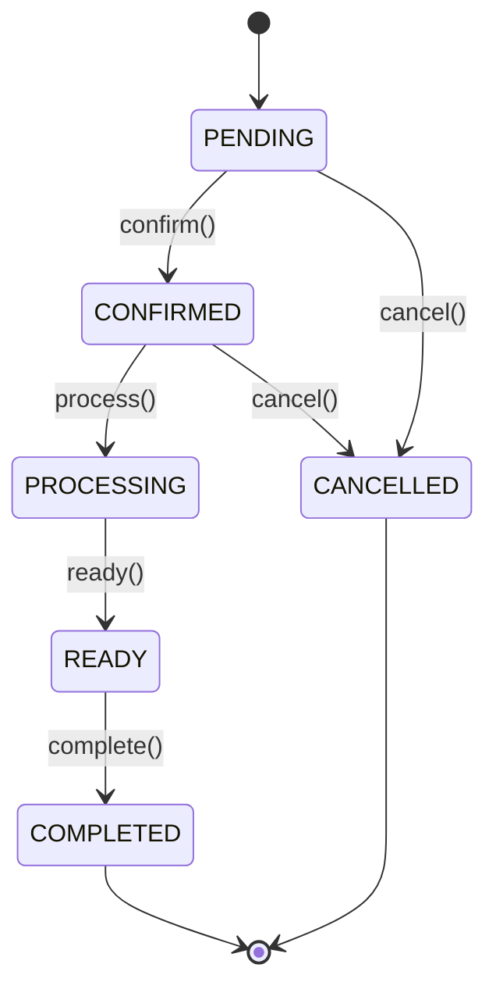

# Order State Diagram

```mermaid
stateDiagram-v2
    [*] --> PENDING
    PENDING --> CONFIRMED : confirm()
    PENDING --> CANCELLED : cancel()
    CONFIRMED --> PROCESSING : process()
    CONFIRMED --> CANCELLED : cancel()
    PROCESSING --> READY : ready()
    READY --> COMPLETED : complete()
    COMPLETED --> [*]
    CANCELLED --> [*]
```

PROCESSING เป็นต้นไปยกเลิกไม่ได้
COMPLETED และ CANCELLED เป็นสถานะสุดท้าย
transition นอกเหนือจากนี้ตอบ HTTP 409 Conflict