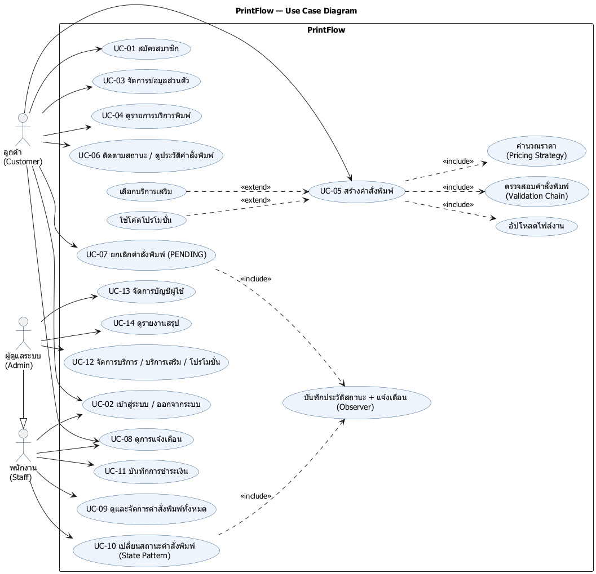

# Use Case Description — PrintFlow

ต้นฉบับ: [`diagrams/use-case.puml`](diagrams/use-case.puml)

## Actors

| Actor | คำอธิบาย |
|---|---|
| ลูกค้า (Customer) | ผู้ใช้ทั่วไปที่สมัครสมาชิกเพื่อสั่งพิมพ์เอกสาร ติดตามสถานะ และดูการแจ้งเตือน |
| พนักงาน (Staff) | พนักงานร้านที่รับคำสั่งพิมพ์ เปลี่ยนสถานะงาน และบันทึกการชำระเงิน |
| ผู้ดูแลระบบ (Admin) | สืบทอดสิทธิ์ทั้งหมดของ Staff และจัดการข้อมูลหลัก บัญชีผู้ใช้ และรายงาน |

## สรุป Use Case

| ID | Use Case | Actor หลัก | ผู้รับผิดชอบ |
|---|---|---|---|
| UC-01 | สมัครสมาชิก | Customer | P1 |
| UC-02 | เข้าสู่ระบบ / ออกจากระบบ | ทุก Actor | P1 |
| UC-03 | จัดการข้อมูลส่วนตัว | Customer | P1 |
| UC-04 | ดูรายการบริการพิมพ์ | Customer | P2 |
| UC-05 | สร้างคำสั่งพิมพ์ | Customer | P3 |
| UC-06 | ติดตามสถานะ / ดูประวัติคำสั่งพิมพ์ | Customer | P3 |
| UC-07 | ยกเลิกคำสั่งพิมพ์ (PENDING) | Customer | P3, P4 |
| UC-08 | ดูการแจ้งเตือน | Customer, Staff | P4 |
| UC-09 | ดูและจัดการคำสั่งพิมพ์ทั้งหมด | Staff | P4 |
| UC-10 | เปลี่ยนสถานะคำสั่งพิมพ์ | Staff | P4 |
| UC-11 | บันทึกการชำระเงิน | Staff | P4 |
| UC-12 | จัดการบริการ / บริการเสริม / โปรโมชั่น | Admin | P2 |
| UC-13 | จัดการบัญชีผู้ใช้ | Admin | P1 |
| UC-14 | ดูรายงานสรุป | Admin | P1 |

---

## UC-01 สมัครสมาชิก

| หัวข้อ | รายละเอียด |
|---|---|
| Actor | Customer (ยังไม่ได้เข้าสู่ระบบ) |
| Precondition | — |
| Postcondition | มีบัญชีใหม่ role `CUSTOMER` ที่เปิดใช้งานแล้ว พร้อมโปรไฟล์ (1:1) และเก็บรหัสผ่านแบบ BCrypt |
| Trigger | ผู้ใช้กด "สมัครสมาชิก" (`/register`) หรือเรียก `POST /api/v1/customers` |

**Main Flow**
1. ระบบแสดงฟอร์ม ได้แก่ ชื่อผู้ใช้ อีเมล ชื่อ นามสกุล เบอร์โทร ที่อยู่ รหัสผ่าน และยืนยันรหัสผ่าน
2. ผู้ใช้กรอกข้อมูลแล้วกดส่ง
3. ระบบตรวจรูปแบบข้อมูลด้วย Bean Validation
4. ระบบตรวจว่าชื่อผู้ใช้และอีเมลยังไม่ถูกใช้
5. ระบบเข้ารหัสรหัสผ่านด้วย BCrypt แล้วบันทึก `users` + `user_profiles`
6. ระบบพาไปหน้าเข้าสู่ระบบพร้อมข้อความ "สมัครสมาชิกสำเร็จ" (API ตอบ `201 Created` + `Location`)

**Alternative / Exception Flow**
- 3a. ข้อมูลไม่ถูกต้อง (อีเมลผิดรูปแบบ รหัสผ่านสั้นกว่า 8 ตัว รหัสผ่านไม่ตรงกัน) → แสดงข้อผิดพลาดรายช่อง (API: `400` + `validationErrors`)
- 4a. ชื่อผู้ใช้หรืออีเมลซ้ำ → แจ้งเตือนและให้แก้ไข (API: `409 Conflict`)

---

## UC-02 เข้าสู่ระบบ / ออกจากระบบ

| หัวข้อ | รายละเอียด |
|---|---|
| Actor | Customer, Staff, Admin |
| Precondition | มีบัญชีที่เปิดใช้งาน (`active = true`) |
| Postcondition | ระบบจดจำผู้ใช้ใน session และแสดงเมนูตาม role |

**Main Flow**
1. ผู้ใช้กรอกชื่อผู้ใช้และรหัสผ่านที่ `/login`
2. ระบบโหลดผู้ใช้ผ่าน `UserDetailsServiceImpl` และเทียบรหัสผ่านด้วย BCrypt
3. ระบบพาไปหน้าแรก navbar แสดงเมนูตาม role
4. ผู้ใช้กด "ออกจากระบบ" → ระบบล้าง session แล้วพากลับไป `/login?logout`

**Alternative / Exception Flow**
- 2a. ชื่อผู้ใช้หรือรหัสผ่านผิด → แสดง "ชื่อผู้ใช้หรือรหัสผ่านไม่ถูกต้อง"
- 2b. บัญชีถูกปิดใช้งาน (soft delete) → เข้าสู่ระบบไม่ได้
- REST API ใช้ HTTP Basic แทน ถ้าไม่ส่งข้อมูลยืนยันตัวตน → `401`

---

## UC-03 จัดการข้อมูลส่วนตัว

| หัวข้อ | รายละเอียด |
|---|---|
| Actor | Customer |
| Precondition | เข้าสู่ระบบแล้ว |
| Postcondition | อีเมลและโปรไฟล์ได้รับการอัปเดต |

**Main Flow**
1. ลูกค้าเปิดข้อมูลของตัวเอง (`GET /api/v1/customers/{id}`)
2. ลูกค้าแก้ไขอีเมล ชื่อ นามสกุล เบอร์โทร หรือที่อยู่ แล้วบันทึก (`PUT /api/v1/customers/{id}`)
3. ระบบตรวจข้อมูลและบันทึก

**Alternative / Exception Flow**
- 1a. ลูกค้าพยายามดูหรือแก้ข้อมูลของคนอื่น → `403 Forbidden` (Staff/Admin ดูได้ทุกคน)
- 3a. อีเมลใหม่ซ้ำกับผู้ใช้อื่น → `409 Conflict`

---

## UC-04 ดูรายการบริการพิมพ์

| หัวข้อ | รายละเอียด |
|---|---|
| Actor | Customer |
| Precondition | — |
| Postcondition | — |

**Main Flow**
1. ลูกค้าเปิดหน้ารายการบริการ
2. ระบบแสดงเฉพาะบริการที่เปิดใช้งาน พร้อมประเภทราคา (ขาวดำ / สี / รูปภาพ) และบริการเสริม
3. ลูกค้าเรียงลำดับหรือแบ่งหน้าได้

---

## UC-05 สร้างคำสั่งพิมพ์

| หัวข้อ | รายละเอียด |
|---|---|
| Actor | Customer |
| Precondition | เข้าสู่ระบบแล้ว และมีบริการที่เปิดใช้งาน |
| Postcondition | มีคำสั่งพิมพ์สถานะ `PENDING` พร้อมรายการพิมพ์ ไฟล์ บริการเสริม โปรโมชั่น และการชำระเงินสถานะ `UNPAID` |

**Main Flow**
1. ลูกค้าเลือกบริการ จำนวนหน้า และจำนวนชุด
2. *(extend)* ลูกค้าเลือกบริการเสริม เช่น เข้าเล่ม หรือเคลือบ
3. *(include)* ลูกค้าอัปโหลดไฟล์งาน
4. *(extend)* ลูกค้าใส่โค้ดโปรโมชั่น
5. *(include)* ระบบตรวจคำสั่งพิมพ์ผ่าน **Chain of Responsibility**: บริการพร้อมให้บริการ → ประเภทไฟล์ → จำนวน → โปรโมชั่นใช้ได้
6. *(include)* ระบบคำนวณราคาด้วย **Strategy** ตามประเภทราคา แล้วหักส่วนลดตามประเภทโปรโมชั่น
7. ระบบแสดงราคาประมาณการ ลูกค้ากดยืนยัน
8. ระบบบันทึกคำสั่งพิมพ์และสร้างการชำระเงินสถานะ `UNPAID`

**Alternative / Exception Flow**
- 5a. บริการถูกปิดหรือไม่มีอยู่ → `404` / แจ้งเตือน
- 5b. ไฟล์ผิดประเภท จำนวนเป็น 0 หรือโปรโมชั่นหมดอายุ → `400` พร้อมข้อความของ handler ที่ไม่ผ่าน

---

## UC-06 ติดตามสถานะ / ดูประวัติคำสั่งพิมพ์

| หัวข้อ | รายละเอียด |
|---|---|
| Actor | Customer |
| Precondition | เข้าสู่ระบบแล้ว |
| Postcondition | — |

**Main Flow**
1. ลูกค้าเปิดประวัติคำสั่งพิมพ์ของตัวเอง (แบ่งหน้า เรียงลำดับ และกรองตามสถานะได้)
2. ลูกค้าเลือกคำสั่งพิมพ์เพื่อดูรายละเอียดและไทม์ไลน์สถานะจาก `order_status_histories`

---

## UC-07 ยกเลิกคำสั่งพิมพ์

| หัวข้อ | รายละเอียด |
|---|---|
| Actor | Customer |
| Precondition | คำสั่งพิมพ์เป็นของลูกค้าคนนั้นและยังอยู่สถานะ `PENDING` |
| Postcondition | สถานะเป็น `CANCELLED` และมีประวัติสถานะกับการแจ้งเตือน |

**Main Flow**
1. ลูกค้ากดยกเลิกคำสั่งพิมพ์
2. ระบบเปลี่ยนสถานะผ่าน State Pattern
3. *(include)* ระบบบันทึกประวัติและสร้างการแจ้งเตือนผ่าน Observer

**Exception Flow**
- 2a. คำสั่งพิมพ์ไม่ได้อยู่สถานะ `PENDING` → `409 Conflict` (`InvalidStateTransitionException`)

---

## UC-08 ดูการแจ้งเตือน

| หัวข้อ | รายละเอียด |
|---|---|
| Actor | Customer, Staff |
| Precondition | เข้าสู่ระบบแล้ว |
| Postcondition | การแจ้งเตือนที่เปิดอ่านถูกทำเครื่องหมายว่าอ่านแล้ว |

**Main Flow**
1. navbar แสดงจำนวนการแจ้งเตือนที่ยังไม่อ่าน
2. ผู้ใช้เปิดรายการการแจ้งเตือน (แบ่งหน้า)
3. ผู้ใช้ทำเครื่องหมายว่าอ่านแล้ว

---

## UC-09 ดูและจัดการคำสั่งพิมพ์ทั้งหมด

| หัวข้อ | รายละเอียด |
|---|---|
| Actor | Staff (และ Admin) |
| Precondition | เข้าสู่ระบบด้วย role `STAFF` หรือ `ADMIN` |
| Postcondition | — |

**Main Flow**
1. พนักงานเปิด Staff Dashboard
2. ระบบแสดงคำสั่งพิมพ์ทั้งหมด กรองตามสถานะ แบ่งหน้า และเรียงลำดับได้
3. พนักงานเลือกคำสั่งพิมพ์เพื่อดูรายละเอียด ไฟล์งาน และการชำระเงิน

---

## UC-10 เปลี่ยนสถานะคำสั่งพิมพ์

| หัวข้อ | รายละเอียด |
|---|---|
| Actor | Staff |
| Precondition | คำสั่งพิมพ์มีอยู่จริง |
| Postcondition | สถานะเปลี่ยนตามเส้นทางที่อนุญาต และมีประวัติสถานะกับการแจ้งเตือนลูกค้า |

**Main Flow**
1. พนักงานเลือกสถานะถัดไป: `PENDING → CONFIRMED → PROCESSING → READY → COMPLETED`
2. ระบบตรวจว่าเปลี่ยนได้ผ่าน **State Pattern** (สถานะแต่ละตัวรู้ว่าไปต่อที่ไหนได้)
3. ระบบเผยแพร่ `OrderStatusChangedEvent`
4. *(include)* **Observer**: `OrderHistoryListener` บันทึกประวัติ และ `InAppNotificationListener` สร้างการแจ้งเตือนให้ลูกค้า

**Exception Flow**
- 2a. เปลี่ยนผิดลำดับ เช่น `COMPLETED → PROCESSING` → `409 Conflict`

---

## UC-11 บันทึกการชำระเงิน

| หัวข้อ | รายละเอียด |
|---|---|
| Actor | Staff |
| Precondition | คำสั่งพิมพ์มีการชำระเงินสถานะ `UNPAID` (1:1 กับคำสั่งพิมพ์) |
| Postcondition | การชำระเงินเป็น `PAID` พร้อมวิธีชำระและเวลา |

**Main Flow**
1. พนักงานเปิดคำสั่งพิมพ์แล้วเลือก "บันทึกการชำระเงิน"
2. พนักงานเลือกวิธีชำระเงินและยืนยัน
3. ระบบบันทึกการชำระเงิน

---

## UC-12 จัดการบริการ / บริการเสริม / โปรโมชั่น

| หัวข้อ | รายละเอียด |
|---|---|
| Actor | Admin |
| Precondition | เข้าสู่ระบบด้วย role `ADMIN` |
| Postcondition | ข้อมูลหลักถูกเพิ่ม แก้ไข หรือปิดใช้งาน |

**Main Flow**
1. Admin เปิดหน้าจัดการบริการ บริการเสริม หรือโปรโมชั่น
2. Admin เพิ่มหรือแก้ไขข้อมูล เช่น ราคาพื้นฐาน ประเภทราคา ช่วงวันที่โปรโมชั่น หรือยอดขั้นต่ำ
3. ระบบตรวจข้อมูลและบันทึก

**Exception Flow**
- 3a. โค้ดโปรโมชั่นซ้ำ → `409 Conflict`

---

## UC-13 จัดการบัญชีผู้ใช้

| หัวข้อ | รายละเอียด |
|---|---|
| Actor | Admin |
| Precondition | เข้าสู่ระบบด้วย role `ADMIN` |
| Postcondition | สร้างบัญชี เปลี่ยน role หรือเปิด/ปิดบัญชีแล้ว |

**Main Flow**
1. Admin เปิด `/admin/users` (API: `/api/v1/admin/users`)
2. ระบบแสดงรายชื่อผู้ใช้ กรองตาม role และแบ่งหน้าได้
3. Admin สร้างบัญชีใหม่ (เช่น STAFF) เปลี่ยน role หรือเปิด/ปิดบัญชี

**Alternative / Exception Flow**
- 3a. ชื่อผู้ใช้หรืออีเมลซ้ำ → แจ้งเตือน (API: `409`)
- 3b. Admin พยายามเปลี่ยน role หรือปิดบัญชีของตัวเอง → ปฏิเสธ (API: `400`) เพื่อป้องกันไม่ให้ไม่มี Admin เหลือในระบบ
- 1a. ผู้ใช้ที่ไม่ใช่ Admin เข้าหน้านี้ → `403 Forbidden`

---

## UC-14 ดูรายงานสรุป

| หัวข้อ | รายละเอียด |
|---|---|
| Actor | Admin |
| Precondition | เข้าสู่ระบบด้วย role `ADMIN` |
| Postcondition | — |

**Main Flow**
1. Admin เปิดหน้ารายงาน
2. ระบบแสดงสรุปจำนวนคำสั่งพิมพ์แยกตามสถานะ ยอดขาย และบริการยอดนิยม
3. Admin เลือกช่วงวันที่เพื่อกรองรายงานได้
